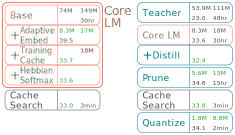

# MicroNet: Team MIT-HAN-Lab

## News
Our work has been accepted by PMLR! [arXiv link](https://arxiv.org/abs/2005.07877)

Hanrui and Zhongxia gave a [talk](https://slideslive.com/38922007/competition-track-day-13) (Starts from 26:17) on the challenge in NeurIPS 2019, Vancouver.


## Introduction
This codebase provides the code, configurations, and commands for our submission to PMLR for representing our work in the NeurIPS 2019 MicroNet Challenge on the [WikiText-103 Language Modeling task](https://micronet-challenge.github.io/index.html). The information for our submission to NeurIPS 2019 MicroNet Challenge can be found [here](https://github.com/mit-han-lab/neurips-micronet/tree/master/neurips_micronet_challenge).

Team members: Zhongxia Yan, Hanrui Wang, Demi Guo, Song Han.

Our work implements or make improvements to the following methods, integrating them to create an efficient language model for the Wikitext-103 task
* [Transformer-XL](https://arxiv.org/abs/1901.02860)
* [Adaptive embedding and softmax](http://arxiv.org/abs/1809.10853)
* [Non-parametric cache](http://arxiv.org/abs/1612.04426)
* [Hebbian softmax](http://arxiv.org/abs/1803.10049)
* [Knowledge distillation with teacher annealing](https://arxiv.org/abs/1907.04829)
* Pruning: we use the [Distiller implementation](https://nervanasystems.github.io/distiller/algo_pruning.html#automated-gradual-pruner-agp) of Automated Gradual Pruning
* Quantization: we use the [Distiller implementation](https://nervanasystems.github.io/distiller/algo_quantization.html) of the quantization aware training of the symmetric range-based linear quantizer.

Our best model achieves a validation perplexity of 34.1 and test perplexity of 35.0 on Wikitext-103, while using 1.8M 32-bit parameters and 8.8M 32-bit math operations.

## MicroNet
The MicroNet challenge website can be found [here](https://micronet-challenge.github.io/). Our best model discussed below gets a MicroNet score of `0.0387`. Note that this is better than our score `0.0475` on the MicroNet website, since we previously had an evaluation error which miscalculated the number of math operations.

## Pipeline
We show our pipeline with incremental performance results. Each row in each column is an ablation on our best configuration [`quantize_prune0.358_distill_8.3M_cache2000_hebbian_step175000_cache3000_bits9`](results/quantize_prune0.358_distill_8.3M_cache2000_hebbian_step175000_cache3000_bits9/config.yaml). The left column does not use compression techniques, while the right column does. From top to bottom, each stack displays the progression of techniques. Each row displays associated metrics: parameters (top left), operations (top right), validation perplexity (bottom left), and estimated processing time (bottom right). Metrics are displayed when changed from the previous row, with green for desirable change and red for undesirable. Red rows represent Core LM techniques, blue rows represent compression techniques, and gray rows represent cache search; joined rows represent joint training.
<p align="center"></p>

## Installation
We run our code on Python 3.6.8 and PyTorch 1.1.0+. We set up our environment using a mixture of Conda and Pip, though in theory Conda shouldn't be necessary. Our code has submodules, so make sure to use `--recursive` while cloning.
```bash
git clone --recursive https://github.com/mit-han-lab/neurips-micronet.git

# If you need to install conda first, follow the instructions from https://docs.conda.io/en/latest/miniconda.html
conda create -n micronet python=3.6
conda activate micronet

# Install distiller (pruning and quantization) requirements
pip install -r distiller/requirements.txt

# For using mixed precision training with https://github.com/NVIDIA/apex
# This is not necessary but some experiments may benefit larger batch sizes with mixed precision training
# Depending on what CUDA version your PyTorch uses, you may have to change the CUDA_HOME environment
# variable in the command below
cd apex && CUDA_HOME=/usr/local/cuda-10.0 pip install -v --no-cache-dir --global-option="--cpp_ext" --global-option="--cuda_ext" ./

pip install enlighten future gitpython==3.1.2
```

## Dataset
Our code in [`setup_data.ipynb`](setup_data.ipynb) directly downloads and preprocesses the [Wikitext-103 dataset](https://blog.einstein.ai/the-wikitext-long-term-dependency-language-modeling-dataset/). Just run all the cells!

## Models and Configurations
All of our configurations are already in the [`results/`](results/) directory. For example, our best configuration evaluated by the MicroNet criteria is [`results/quantize_prune0.358_distill_8.3M_cache2000_hebbian_step175000_cache3000_bits9`](results/quantize_prune0.358_distill_8.3M_cache2000_hebbian_step175000_cache3000_bits9/config.yaml). You can download our trained models from [here](https://www.dropbox.com/sh/8b37zkfvuyog4tu/AAB1wH9GgQgVgO1b7Lh0Pap4a?dl=0) into your directory. The necessary files to evaluate a particular configuration are
```bash
results/<configuration_name>/config.yaml # this contains readable hyperparameters that we use
results/<configuration_name>/cache_step<searched_checkpoint_step>_n<search_cache_size>.yaml # this contains local searched cache parameters for the particular checkpoint step and local search cache size
results/<configuration_name>/models/model-<step>.pth # this contains the step number, saved weights of the network, and saved weights of any optimizer
```

Configuration names are mostly intuitive. We use `attn129` and `attn257` to denote `C = 129` and `C = 257`, respectively, otherwise the default is `C = 97`. For quantization configurations, for example `quantize_prune0.358_distill_8.3M_cache2000_hebbian_step175000_cache3000_bits9`, the first `cache<size>` refers to the training cache size, the second `cache<size>` refers to the local search cache size, and `step<number>` refers to the checkpoint step of the model before quantization.

### Evaluation
To evaluation our trained model, make sure to download it as mentioned above, then go to [`micronet_evaluate.ipynb`](micronet_evaluate.ipynb) and substitute in the configuration name. This gives the validation and test perplexities as well as the number of parameters and math operations after pruning and quantization.

### Running the Pipeline
In general, we run the pipeline from the desired configuration directory (e.g. [`results/quantize_prune0.358_distill_8.3M_cache2000_hebbian_step175000_cache3000_bits9/`](results/quantize_prune0.358_distill_8.3M_cache2000_hebbian_step175000_cache3000_bits9/)).

#### Training the Core LM with or without Distillation
You can refer to [`results/`](results/) for examples of configurations for training with / without adaptive softmax, training cache, Hebbian softmax, or distillation. You may also use this to train a teacher model. To start training, you can use an existing configuration directory or create a new one, then run
```bash
cd <configuration_directory>
# Make sure your directory has the correct config.yaml file

CUDA_VISIBLE_DEVICES=<device> python ../../main.py .
```
We recommend that you modify the `train_batch` hyperparameter in the `config.yaml` to be the maximum that fits in memory. If you'd like to use mixed precision training with [Apex](https://github.com/NVIDIA/apex) Amp, make sure to install Apex as in the instruction, then `opt_level=O1` as an argument to the command. Note that sometimes the cache or Hebbian softmax have instabilities with using mixed precision training. In that case you could try to debug the code or just use full precision.

#### Generating Soft Labels for Distillation
If you'd like to use distillation and you have already trained a teacher model, you may generate the top 30 soft labels for the training set tokens by running this from the teacher's `<configuration_directory>`
```bash
cd <configuration_directory>
CUDA_VISIBLE_DEVICES=<device> python ../../gen_soft_labels.py .
```
Note that this takes around 40G of disk storage and may take several hours.

#### Pruning
After you train a model for a configuration `<configuration_directory>` with the above instructions, you can run
```bash
cd <configuration_directory>
CUDA_VISIBLE_DEVICES=<device> python ../../setup_prune.py .
```
This will automatically create a new configuration directory `<prune_configuration_directory>` for you. Just follow the printed instruction to run pruning. Note that by default this uses the pruning configuration for sparsity `0.358`. You can also use pruninf configuration for sparsity `0.239` and `0.477` by replacing the `distiller_prune.yaml` in your `<prune_configuration_directory>` with [`distiller_prune0.239.yaml`](distiller_prune0.239.yaml) or [`distiller_prune0.477.yaml`](distiller_prune0.477.yaml).

#### Cache Local Search
You may run local search on either a pruned model or unpruned (but trained) model. This will generate a new `<configuration_directory>/cache_step<searched_checkpoint_step>_n<search_cache_size>.yaml` with your searched cache configuration.
```bash
cd <configuration_directory>
CUDA_VISIBLE_DEVICES=<device> python ../../cache_search.py . n_cache=<search_cache_size>
```
This will by default run search on the checkpoint trained for the largest number of steps. If you want to run local search on an arbitrary saved checkpoint step, then add the argument `step=<trained_step_that_you_want_to_search>`.

#### Quantization
You may quantize a trained model, pruned model, or a local-searched model.
```bash
cd <configuration_directory>
CUDA_VISIBLE_DEVICES=<device> python ../../setup_quantize.py . bits=<bits_to_quantize_to>
```
This will by default quantize the largest checkpoint with the `n_cache` value in `<configuration_directory>/config.yaml`. If you'd like to quantize with a different cache size (possibly with local searched parameters), you can add the argument `n_cache=<cache_size>`. If you'd like to quantize a different step, add the argument `step=<trained_step_that_you_want_to_quantize>`, this will by default use your cache parameters if you performed local search with that step previously.

## Common Questions / Errors
>AssertionError: Training already exists

Usually this happens if you try to run training again after your training crashes. This is because we have a guard against accidentally running multiple trainings as the same time. Just remove the `<configuration_directory>/is_training` guard file and you should be fine.

>Why is the perplexity `nan`?

To prevent obscenely large perplexities at the beginning of training, we set perplexities greater than `e ** 5` to be `nan`.

## FAQ
If you have any further questions about our submission, please don't hesitate reaching out to us through Github Issues :)
Thanks!
